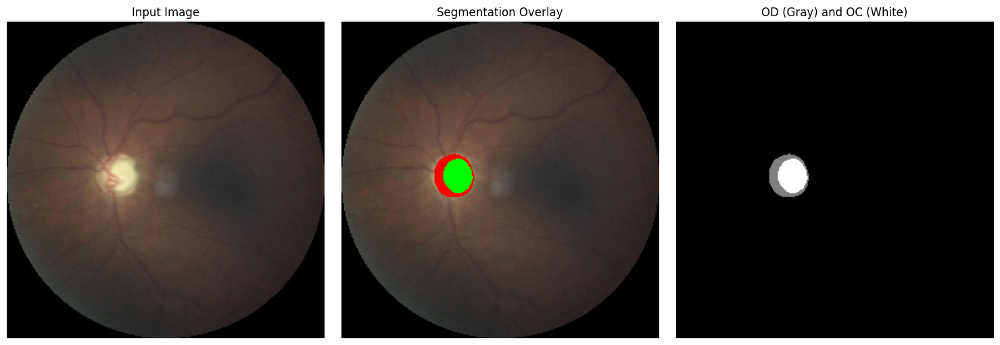

# Glaucoma Detection Pipeline

This repository contains our final-year project on **glaucoma detection from retinal fundus images**.

The project is built around two main components:

- **retinal vessel segmentation** for vascular feature analysis
- **optic disc / optic cup segmentation** for structural analysis

Instead of treating glaucoma detection as a pure black-box classification problem, we built a more interpretable pipeline around clinically meaningful features such as:

- **Vertical Cup-to-Disc Ratio (vCDR)**
- **Vessel Density (VD)**
- **Fractal Dimension (FD)**
- **Vessel Width**
- **Vessel Tortuosity**

This project was developed as part of our final-year academic work, with support and involvement from BioScan AI.

---

## Repository Structure

```text
.
├── Main_Vessel_Segmentation_Part.ipynb   # vessel segmentation + vascular feature extraction
├── Main_oc_od.ipynb                      # optic disc/cup segmentation + vCDR analysis
└── README.md
```

---

## Running the Project

### Setup
Install the common dependencies first:

```bash
pip install torch torchvision opencv-python numpy matplotlib Pillow pandas scikit-image scipy scikit-learn tqdm
```

### Run
Open the notebooks in Jupyter Notebook or Google Colab and update the file paths based on your local dataset / Drive setup.

You can run the notebooks as the two main parts of the project:

- `Main_Vessel_Segmentation_Part.ipynb`
- `Main_oc_od.ipynb`

After that, use the generated outputs, extracted features, and CSV files for the final glaucoma analysis workflow.

---

## Future Improvements

Some natural next steps for this project would be:

- converting the notebooks into a cleaner modular package
- adding proper dataset preparation instructions
- packaging model checkpoints and configs
- improving reproducibility
- unifying the final classification stage into one cleaner pipeline
- adding a small demo or web interface

